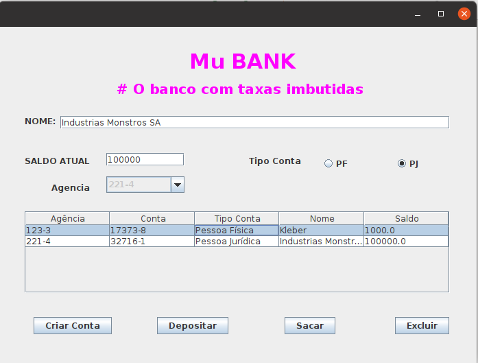
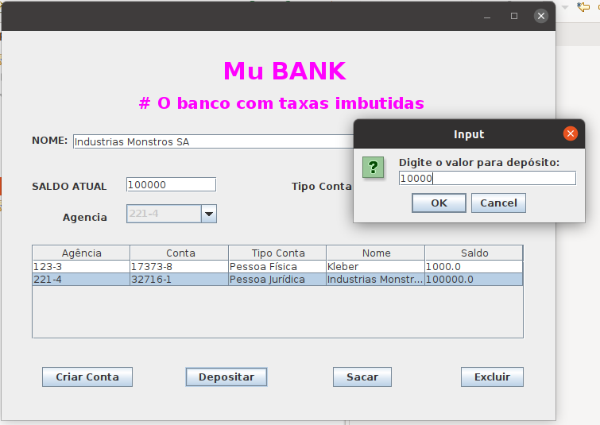
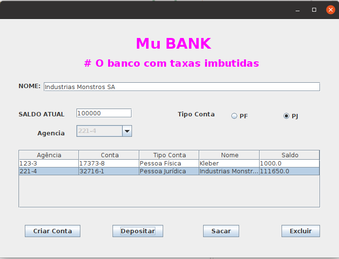
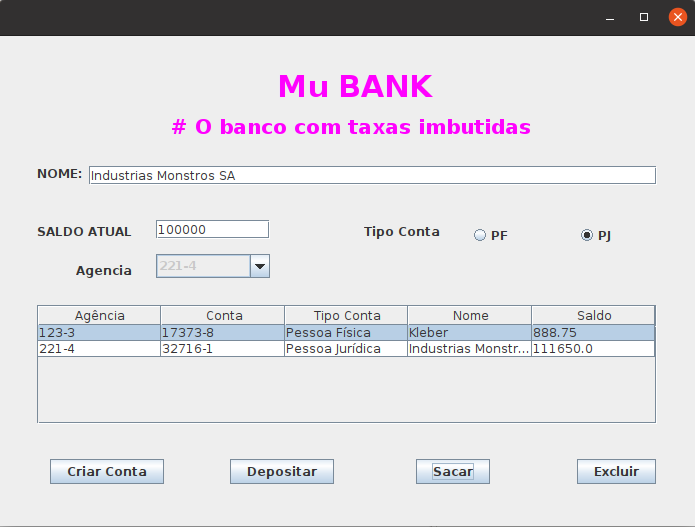

# Exercicio 2 - Paradgma POO (SistemabancarioPOO)

------

1. Use o window builder paraconstrução da Tela;
2. Use o polimorfismo e herança(recursos do POO)
3. Utilize cálculos diferentes para asoperações de crédito e débito
4. O depósito em conta PJ deverá terum acréscimo de 1.5% a cada operação 
5. E o saque na conta PF terá um desconto de 1.25%.

## Resultados

     
    
    <h5 align="center">Figura 1 - Tela de cadastro de clientes.</h5>
     

     
    
    <h5 align="center">Figura 2 - Deposito em conta de pessoa jurídica (JOptionPane).</h5>
     

     
    
    <h5 align="center">Figura 3 - Deposito em conta de pessoa jurídica (consolidado na tabela).</h5>
     

     
    
    <h5 align="center">Figura 4 - Seque em conta de pessoa fisica (consolidado na tabela).</h5>
     

